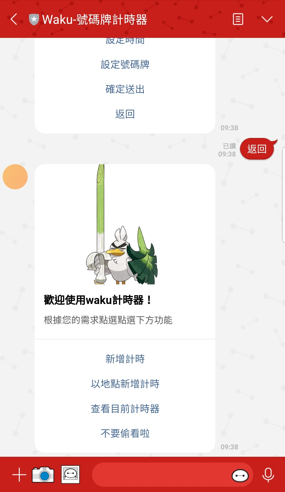

# Waku counter - TOC Project 2020

A counter that can caculate when turn Line bot based on a finite state machine

## Finite State Machine

## Introduction

一個能大概算還有多久才會輪到你的號碼牌計時器。專案概念為把平常我們排隊領到號碼牌後的「預估行為」用Line bot去取代，並結合有點像是區塊鏈的概念，讓每個人能貢獻「等待時間」，其他人不須預估就能直接使用計時器。

## Basic feature
*   計算時間: 給予「換一個號」所需的時間，以及目前輪到的號碼和自己手上的號碼後，程式會自動計算還需要的時間，並在時間剩下1/4的時候回傳訊息提醒你時間快到了。

*   自動計時: 你不需要切換到其他App的鬧鐘，只要在一號開始時按下「開始計時」，換號時按下「結束計時」

*   多重計時: 在計時的同時可以再設定新的計時器。你也可以擁有多個計時器，給予他們各自的名字。各個計時器間不受彼此影響。
*   修改計時: 計時過程中可隨時修改計時器內容
*   獨立state: 不同用戶的state不受彼此影響

## Advance feature
*   Database: 使用者可以把自己的計時器和目前所在位置資訊結合，把資料傳送到後端並儲存。後端採MVC架構，資料庫使用MySQL (ClearDB provide by heroku)。
*   位置資訊的取得和使用: 可以透過輸入地點名稱或地理資訊(Line可以回傳自動偵測的GPS資訊)來回傳地點資訊。在一開始也能用地理資訊來取得資料庫中所有該位置數據的**平均時間**。

## Why the Idea from Block chain ?

資料庫中單一位置的時間數據回傳值是根據所有其他人提供的數據的**平均時間**。

而為了防止惡意提供假數據，當新的資料想要儲存進入資料庫時，會先進入以下步驟:

### 【 Step 1 】判斷是否離群
若新資料距離舊資料平均的不超過兩個標準差，則認定為真資料並更新資料庫；若超過兩個標準差，則進入下一步。

### 【 Step 2 】判斷離群資料是否為真
以**新資料的地點名稱為參數**，呼叫pythrends api。該api會回傳Google 關鍵字在過去7天內該地點的**搜尋熱度趨勢**。 當最近一天的趨勢也是超過「前6天趨勢的平均+-2標準差」時，認定新資料為真，並更新資料庫。反之則不儲存該資料。

